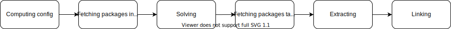

.. _detailed_operations:

Detailed operations
===================

Overview
--------

| This section explains what are the main operations in details.

Please have a look at the :ref:`more concepts<more_concepts>` section, the following documentation relies heavily on it.

.. _detailed_install:

Install
-------

The ``install`` operation is using a ``package specification`` to add/install additional packages to a :ref:`target prefix<prefix>`.

The workflow for that operation is:

- computing :ref:`configuration<configuration>`
- fetching/downloading packages index from repositor(y)(ies)
- solving
- fetching/downloading packages tarballs
- extracting packages
- :ref:`linking<linking>` packages

