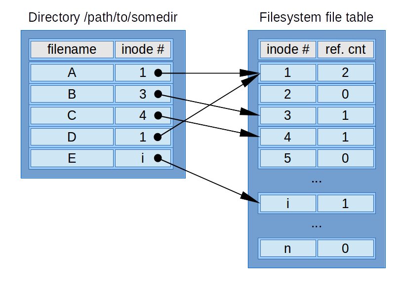

.. _more_concepts:

More concepts
=============

Overview
--------

| This section complements :ref:`concepts<concepts>` with advanced terminology.

While not necessary to understand the basic usage, those ``advanced concepts`` are fundamental to understand Mamba in details.

.. _repo:

Packages repository
-------------------

| A packages repository, also called ``repo``, is a generic way to describe a storage location for software packages.

In the Mamba's context, it may points to a packages server, a :ref:`channel<channel>` or a :ref:`subdir<subdir>`.

.. _channel:

Channel
-------

| A ``channel`` is an independent and isolated :ref:`repo<repo>` structure that is used to classify and administrate more easily a packages server.

.. note::
  A packages server may host one or multiple ``channels``.

.. _subdir:

Subdir
------

| A ``subdir`` is a :ref:`channel<channel>` subdirectory specific to a given operating system/platform pair.

Mamba is a general purpose, language agnostic package manager. The ``subdir`` structure is a convenient way to provide and access packages depending on the targeted os and platform.

Typically ``linux-64``, ``osx-arm64`` or ``win-64`` but not limited to those ones.

A ``subdir`` provides the packages tarballs alongside a :ref:`packages index<repodata>` including additional metadata.

.. note::
  In most cases, both ``noarch`` and ``<os>-<platform>`` subdirs are used for an operation requiring data from the :ref:`repo<repo>`

.. _repodata:

Packages index
--------------

| A repository package index is a file containing metadata about all the packages tarballs served by a :ref:`repo<repo>`.

.. note::
  Those metadata include license, file size, checksums, etc.

In Mamba, it is more often called a ``repodata`` in reference to the index filename ``repodata.json``.

A ``repodata`` is specific to a :ref:`channel subdirectory<subdir>`.

.. _tarball:

Package tarball
---------------

| A tarball is a single archive file, compressed or not, that expands to multiples files/directories. It is typically a ``zip`` file or so.

In the case of Mamba, 2 ``conda`` formats are used as package tarball:

- ``tar.bz2`` is the historical formats: a ``tar`` file/ball that has been compressed using ``bzip2`` algorithm
- ``conda`` more recent format that allows faster access to packages metadata

.. _linking:

Linking
-------

Each package contains its files index, used at a step called ``linking``.
The ``linking`` consists in creating a *link* between the package cache where the tarballs are expanded into multiple directories/files and the installation :ref:`target prefix<prefix>`.

The 3 kinds of *links* are:

- :ref:`hard-link<hard_link>`
- :ref:`soft-link<soft_link>`
- :ref:`copy<copy>`

| The default behavior is to use ``hard-links`` and fallback to ``copy``.

The advanced user may want to change that behavior using configuration (see the relevant CLI or API reference for more details):

- allow ``soft-links`` to be used as a preferred fallback to ``copy`` (try to ``copy`` if ``soft-link`` fails)
- use ``soft-links`` instead of ``hard-links`` as default behavior (``copy`` is still a fallback)
- always ``copy`` instead of ``hard-links`` as default behavior (no fallback then)

.. warning::
   ``soft-links`` more easily lead to broken environment due to their property of becoming invalid when the target is deleted/moved

.. _hard_link:

Hard-link
*********

| A ``hard-link`` is the relation between a name/path and the actual file located on the file system.
| It is often used to describe additional ``hard-links`` pointed the same file, but the ownership of the file is shared across all those links (equivalent to a C++ shared pointer):

- a reference counter is incremented when creating a new ``hard-link``, decremented when deleting one
- the file system location is freed only when that counter decreases to 0

source: `Wikipedia <https://en.wikipedia.org/wiki/Hard_link>`_

This is the most efficient way to link:

- the underlying file on the file system is not duplicated

  - it is super efficient and resource friendly

- ``hard-link`` stays valid when another ``hard-link`` to the same reference is deleted/moved

There are some limitations to use ``hard-links``:

- all the file systems are not supporting such links
- those links are not working across file systems/partitions

.. _soft_link:

Soft-link
*********

| A ``soft-link``, also called ``symlink`` (symbolic link), is much more similar to a shortcut or a redirection to another name.

It is as efficient as a ``hard-link`` but has different properties:

- works across a filesystem/partition boundaries
- becomes invalid then the pointed name is deleted or moved (no shared ownership)

.. _copy:

Copy
****

| This is a most well-known link, a simple copy of the file is done.

It is not efficient nor resource friendly but preserve the file from deletion/modification of the reference.
