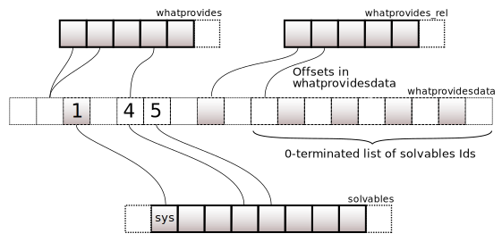

Internals of mamba
==================

Mamba comes with a C++ core (for speed and efficiency), and a clean Python API on top. The core of mamba uses:

- ``libsolv`` to solve dependencies (the same library used in RedHat dnf and other Linux package managers)
- ``curl`` for reliable and fast downloads
- ``libarchive`` to extract the packages

.. _libsolv_internals:

libsolv
-------

pool
****

| The ``pool`` holds pointers of almost all the data manipulated in ``libsolv``.

Some are presented here:

- string pool ``Stringpool``
- relations of dependency ``Reldep``
- solvables/packages ``Solvable``
- repositories ``Repo``
- data about providers of a specific name or relation, as ``Id`` s and ``Offset`` s (resp. ``int`` and ``unsigned int``) for maximum performance

Sizes of allocated memory or offset to the first free slot are also stored.

.. mermaid::
   :align: center

    classDiagram

      class Pool{
          +Stringpool ss
          +Reldep *rels
          +int nrels
          +Repo **repos
          +int nrepos
          +int urepos
          +Repo *installed
          +Solvable *solvables
          +int nsolvables
          +Offset *whatprovides
          +Offset *whatprovides_rel
          +Id *whatprovidesdata
          +Offset whatprovidesdataoff
          +int whatprovidesdataleft

          ...
      }

Ids
###

Strings (package names, requirements, etc.) are converted to ``Id`` s using a hash table for efficient data manipulation (storage, usage).

- ``Id pool_str2id(Pool *pool, const char *str, int create)`` is used to get an ``Id`` from a string

  - It eventually creates a fresh one if not existing

- ``const char *pool_id2str(const Pool *pool, Id id)`` is used to get back the string from ``Id``

.. warning::
   Do not use ``solvable`` ``Id`` s with ``pool_id2str``, use the equivalent ``const char *pool_solvid2str(Pool *pool, Id p)``

Reldeps
#######

A ``Reldep`` describes a relation of dependency with:

- a ``name`` Id
- an epoque version ``evr`` Id
- some ``flags``: ``REL_CONDA`` in our case

.. mermaid::
   :align: center

    classDiagram
      class Reldep{
          +Id name
          +Id evr
          +int flags
      }

An example could be ``{1, 2, 30}``, with:

- ``1`` the Id for ``"xtensor"``
- ``2`` the Id for ``">=0.20"``
- ``30`` the ``REL_CONDA`` flag

| The pool holds a ``Reldep *rels`` pointer on the first memory location and the size ``int nrels`` of allocated memory.

``Reldep`` are also handled with ``Id`` s that have bit 31 used as a flag to distinguish them from regular ``Id`` s.

There are multiple macros that help to convert those special ``Id`` s:

- ``MAKERELDEP(id)``: turn a regular ``Id`` into a ``Reldep`` ``Id``
- ``ISRELDEP(id)``: test the bit 31
- ``GETRELID(id)``: get the regular ``Id``
- ``GETRELDEP(pool, id)``: get the ``Reldep`` from its ``Id``

.. note::
   ``pool_id2str`` also works with ``Reldep`` ``Id`` s! But it will only returns the ``Reldep`` 's ``name``

Offsets
#######

An ``Offset`` represents a positive or negative shift of a pointer on an array.

For example, a *solvable* does not contain all its data but rather holds multiple offsets on its ``repo->idarraydata`` storage.

- ``idarraydata`` is an ``Id`` pointer
- ``provides``, ``requires``, etc. are offsets in ``idarraydata``

whatprovides
************

A ``provider`` is a *solvable* fulfilling a *specification*. The following definitions are key to disambiguate how ``libsolv`` works:

- a *package* is an identification of the resource handled: a name such as ``xtensor``

- a *solvable* is a specific version of the *package*. It can be assimilated to its tarball.

  - in ``Mamba``, a *solvable* name MUST match the package name
  - ``libsolv`` handles cases where *solvables* are providing different entities than what identified in their names (example: ``pynum`` providing ``numpy``)

    - this is not used, but important to know to understand the terminology

- a *specification*: an expression to match *solvables* providing the same *package*

  - the package name can be used to select all providers/*solvables*
  - a more specific *spec* like ``s2="xtensor>=0.20"`` will only match a subset of *solvables*: the ones that have version >=0.20 (whatever the build string)

Let's take a simple example to recap:

- the package: ``xtensor``
- solvable(s):

  - ``xtensor=0.20.10=hc9558a2_0``
  - ``xtensor=0.23.10=h4bd325d_0``
  - etc.

- specification(s):

  - ``xtensor``
  - ``xtensor>=0.20``
  - etc.

.. note::
   It's possible that a *package* is not provided by any *solvable*. It is then uninstallable.

.. mermaid::
   :align: center

    %%{init: {'themeVariables':{'edgeLabelBackground':'white'}}}%%
    graph TD
        subgraph " "
        spec1((s1)) -.-> solvable1:::solvable
        spec1 -.-> solvable2:::solvable
        ...:::empty
        spec1 -.-> solvableN:::solvable

        spec2((s2)) -.-> solvableN:::solvable
        end
        classDef solvable fill:#f96;
        classDef empty fill:#ffffff00,stroke:#ffffff00;

.. note::
   Specifications are stored as ``Id`` s (see the previous section)

.. warning::
   While a ``solvable`` is a ``libsolv`` notion, ``specs`` and ``packages`` are not.

Storage
#######

| The free function ``void pool_createwhatprovides(Pool *pool)`` is used to create hashes over pool of solvables to ease provide lookups.

It computes and store what *solvables* provide each *spec*, using a two-step indirect list:

- from the spec ``Id``, an offset is computed in ``Id *whatprovidesdata``

  - ``Offset *whatprovides`` stores regular string specs
  - ``Offset *whatprovides_rel`` stores ``Reldep`` specs

- ``whatprovidesdata`` at the given offset is a 0-terminated list of *solvables* ``Id`` s, providing the spec ``Id``

Lookups
#######

The ``pool_whatprovides(Pool *pool, Id d)`` function returns the offset of the first solvable ``Id`` in ``whatprovidesdata``:

.. mermaid::
   :align: center

    graph LR
        A{"ISRELDEP(d)?"} -->|Yes| B1["whatprovides[d]"];
        A -->|No| B2["whatprovides_rel[GETRELID(d)]"];
        B1 --> C{0?};
        B2 --> C;
        C -->|Yes| D1["pool_addrelproviders[d]"];
        C -->|No| D2((return));
        D1 --> D2;

Rules
*****

A *rule* is all about *solvables*, it represents a logical disjunction ``OR`` between one or more literals.

Rules are created to translate in mathematical logic:

- a specification: installation/removal/updates

  - ``(A)`` means ``A`` must be installed
  - ``(-A)`` means ``A`` must be removed or kept uninstalled
  - ``(A|B1|B2|...)`` means ``A`` could be updated with ``B1``, ``B2``, etc.

- a dependency: ``A`` needs/requires ``b`` (a *spec*)

  - ``(-A|B1|B2|...)`` means ``A`` requires one of ``B1``, ``B2``, etc. (``b`` providers)

- an incompatibility: ``A1`` can't be installed alongside ``A2``

  - ``(-A1|-A2), (-A1|-A3), ...`` means ``A1`` is not compatible with ``A2``, ``A3``, etc.
  - this is a common case: multiple providers of the same package

- etc.

Still for efficiency, *rules* are storing ``Id`` s of *solvables* and *specs*:

- ``p`` is the package ``Id`` of ``A``
- ``d`` is the package ``Id`` offset into the list of providers (negative value means the rule is disabled)
- ``w1`` and ``w2`` are watches
- ``n1`` and ``n2`` are the next rules in linked-lists, corresponding to ``w1`` and ``w2``

.. mermaid::
   :align: center

    classDiagram
      class Rule{
          +Id p
          +Id d
          +Id w1
          +Id w2
          +Id n1
          +Id n2
      }

Dependencies
############

Each dependency is turned into a rule to be satisfied during the solving stage.

Example:

- ``p1`` and ``p2`` are 2 specs
- ``p1`` is provided by a single solvable ``s11``
- ``p2`` is provided by ``s21`` and ``s22``

.. mermaid::
   :align: center

    %%{init: {'themeVariables':{'edgeLabelBackground':'white'}}}%%
    graph LR
        subgraph p1 providers[ ]
        p1((p1)):::package -.-> s11:::solvable
        end
        s11:::solvable --> p2((p2)):::package
        subgraph p2 providers[ ]
        p2((p2)):::package -.-> s21:::solvable
        p2((p2)):::package -.-> s22:::solvable
        end

        classDef solvable fill:#f96;

The corresponding rule ``r`` is ``-s11|s21|s22``.

That means that taking the decision to install ``s11``:

- ``-s11`` is not satisfied
- either ``s21`` or ``s22`` need to be satisfied

.. note::
    Exclusive rules are used to avoid installation of multiple solvables providing the same package

Watches
#######

| Watches are a way to link rules. They are triggered during a phase called ``propagation`` after decisions taken on previous rules for some solvable.

The possible decisions on solvables are ``installation`` or ``removal``/``conflict``, this is stored as resp. positive and negative Ids.

Related rules are then evaluated during another level of decision: those are the one with an opposite first literal.

Example:

- the install spec is to install ``p1`` provided by a single solvable ``s1``: ``r1=(s1)``
- ``s1`` depends on spec ``p2``, provided by ``s21`` or ``s22``: ``r2=(-s1|s21|s22)``
- decision to install ``s1`` triggers rule ``r2``

Transaction
***********

Another important part of libsolv is the ``Transaction``. A transaction governs what packages are installed or removed, and a transaction is the result of a successful solve process.

A transaction in libsolv is a single list (Queue) of Solvable ``Id's`` and is thus rather simple. The Queue contains either a positive or negative ``Id``. Each negative ``Id`` is ``uninstalled`` from the environment, and each positive ``Id`` is to be ``installed``. libsolv classifies the entire range of Id's into different types of transaction operations. For example, if we have ``{ -5, 5 }`` that would be a reinstall transaction for the Solvable with ``Id == 5``.
If the ``Id's`` are different then it can be a downgrade or upgrade operation (first, the previous package needs removal before the higher or lower version can be installed). The ``transaction_classify`` and ``transaction_classify_pkgs`` functions of libsolv take care of this classification to present a nice output to the user.

Another crucial libsolv function is ``transaction_order`` to order the transaction in a way that they are installed with the lowest dependency first (topological sort). This ensures that e.g. ``python`` is installed before any packages depending on ``python`` as they are sometimes needed during installation (for example for ``noarch`` packages with ``entry_points``).

Lastly, we can force installation or explicitly install from URL's by crafting transactions without using the solver – just by adding the correct ``Id's`` into the Transaction queue.
