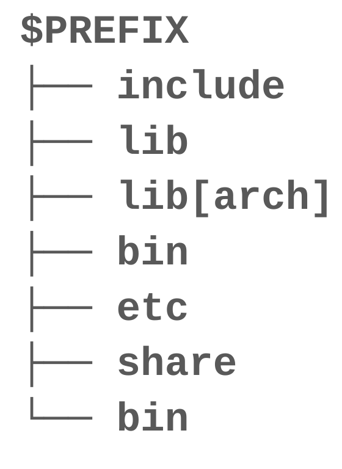

.. _concepts:

Concepts
--------

A few concepts are extensively used in ``Mamba`` and in this documentation as well.
You should start by getting familiar with those as a starting point.

.. _prefix:

Prefix/Environment
==================

In Unix-like platforms, installing a piece of software consists of placing files in subdirectories of an "installation prefix":

- no file is placed outside of the installation *prefix*
- dependencies must be installed in the same *prefix* (or standard system prefixes with lower precedence)

.. note::
    Examples on Unix: the root of the filesystem, the ``/usr/`` and ``/usr/local/`` directories.

| A *prefix* is a fully self-contained and portable installation.
| To disambiguate with :ref:`root prefix<root-prefix>`, *prefix* is often referred to as *target prefix*. Without an explicit *target* or *root* prefix, you can assume it refers to a *target prefix*.

An *environment* is just another name for a *target prefix*.

Mamba's environments are similar to virtual environments as seen in Python's ``virtualenv`` and similar software, but more powerful since Mamba also manages *native* dependencies and generalizes the virtual environment concept to many programming languages.

.. _root-prefix:

Root prefix
===========

When downloading for the first time the index of packages for resolution of the environment, or the packages themselves, a *cache* is generated to speed up future operations:

- the index has a :ref:`configurable<configuration>` time-to-live (TTL) during which it will be considered as valid
- the packages are preferentially hard-linked to the *cache* location

This *cache* is shared by all *environments* or *target prefixes* based on the same *root prefix*. Basically, that *cache* directory is a subdirectory located at ``$root_prefix/pkgs/``.

The *root prefix* also provide a convenient structure to store *environments* ``$root_prefix/envs/``, even if you are free to create an *environment* elsewhere.

.. _base-env:

Base environment
================

.. note::
  This section does not apply to Micromamba.

The *base* environment is the environment located at the *root prefix*.

| This is a legacy *environment* from ``conda`` implementation that is still heavily used.
| The *base* environment contains the ``conda`` and ``mamba`` installation alongside a Python installation (since ``mamba`` and ``conda`` require Python to run).
| ``mamba`` and ``conda``, being themselves Python packages, are installed in the *base* environment, making the CLIs available in all *activated* environments *based* on this *base* environment.

Activation/Deactivation
=======================

.. _activation:

Activation
**********

The *activation* of an :ref:`environment<prefix>` makes all its contents available to your shell. It mainly adds *target prefix* subdirectories to your ``$PATH`` environment variable.

.. note::
  *activation* implementation is platform dependent.

| When *activating* an environment from another, you can choose to ``stack`` or not upon the currently activated env.
| Stacking will result in a new intermediate :ref:`prefix<prefix>`: ``system prefix < base < env1 < env2``.

.. _deactivation:

Deactivation
************

The *deactivation* is the opposite operation of :ref:`activation<activation>`, removing from your shell what makes the environment content accessible.
